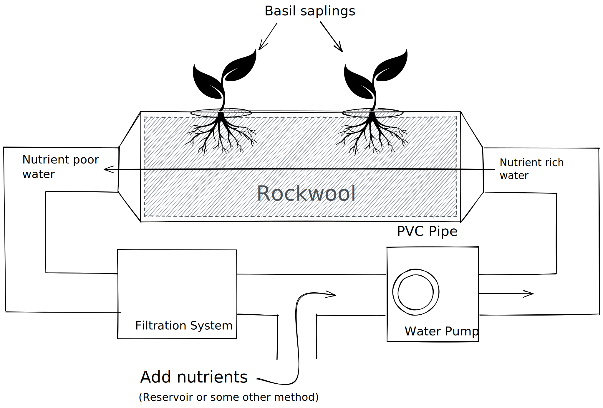

# Hydroponic Basil-Growing Setup

The basic setup is as follows:

## Components

- [1/2in PVC Pipe](https://www.homedepot.com/p/JM-EAGLE-1-2-in-x-10-ft-600-PSI-White-Schedule-40-PVC-Pressure-Plain-End-Pipe-530048/100113200)
- [Water Pump](https://www.homedepot.com/p/Viagrow-159-GHP-Hydroponic-Fountain-and-Pond-Submersible-Pump-VHL-600F/204184841)

## Design

## Control System

## Resources

- [TheBetterIndia: How to Build a Hydroponic Unit With PVC Pipes to Grow Veggies](https://www.thebetterindia.com/205495/how-to-build-hydroponics-unit-pvc-pipes-cheap-veggies-soilless-farming-india/)
- [5 Tips For Growing Hydroponic Basil At Home](https://thegreengardenlife.com/growing-hydroponic-basil-at-home/)
